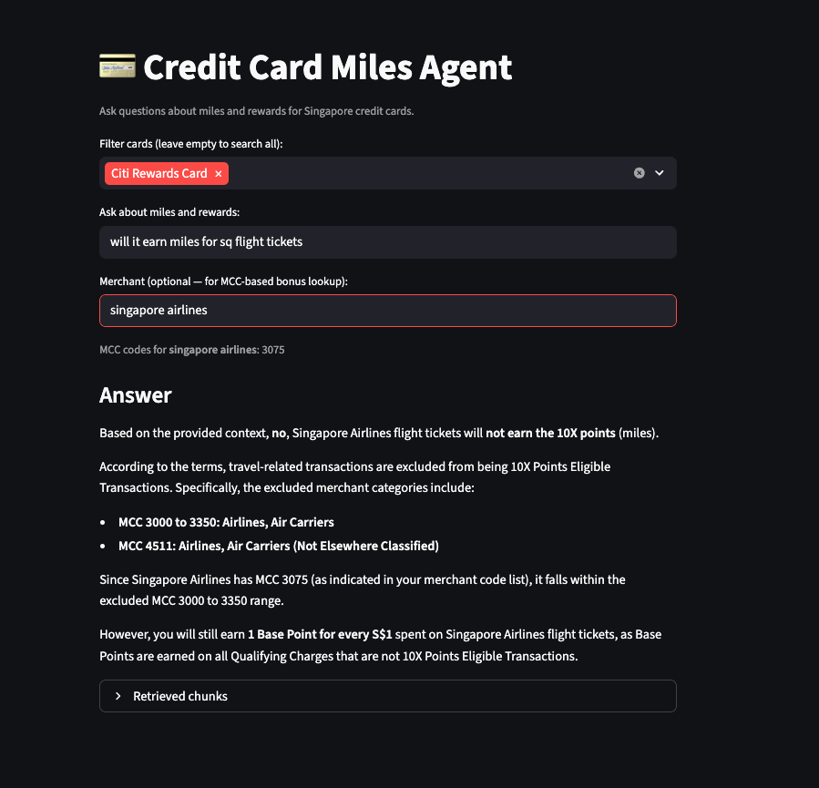

# Credit Card Miles Agent

A Retrieval-Augmented Generation (RAG) chatbot for comparing miles and rewards across Singapore credit cards. Ask natural language questions and get answers grounded in the official T&C PDFs.



## Features

- Answers questions about miles earn rates, bonus categories, and rewards redemption
- Covers 5 cards: Citi Rewards, HSBC Revolution, DBS Women's World, UOB PPV, OCBC Rewards
- Optional merchant lookup — paste a merchant name to auto-resolve its MCC codes via HeyMax, giving the model richer context for bonus category questions
- Filter retrieval to specific cards via multiselect, so comparisons stay focused
- One-click data reload that clears and re-ingests all card T&C PDFs

## Setup

**1. Install dependencies**

```bash
pip install -r requirements.txt
```

**2. Configure environment variables**

Create a `.env` file in the project root:

```env
OPENAI_API_KEY=sk-...
EMBEDDING_MODEL=text-embedding-3-small
CHAT_MODEL=gpt-4o
COLLECTION_NAME=credit-cards
PERSIST_DIRECTORY=./db/index
```

**3. Run the app**

```bash
streamlit run main.py
```

**4. Load card data**

Click **Reload card data** in the sidebar to ingest the T&C PDFs into the vector store. This only needs to be done once (or whenever you want to refresh the data).

## Configuration

Card PDF URLs are hardcoded in `CARD_URLS` at the top of `main.py`. Update any URL to point to a newer T&C document and click **Reload card data** to re-index.

```python
CARD_URLS = {
    "CITI_REWARDS": "...",
    "HSBC_REVOLUTION": "...",
    "DBS_WOMEN_WORLD": "...",
    "UOB_PPV": "...",
    "OCBC_REWARDS": "...",
}
```

## Stack

- [Streamlit](https://streamlit.io) — UI
- [LangChain](https://python.langchain.com) — document loading, splitting, retrieval
- [Chroma](https://www.trychroma.com) — local vector store
- [OpenAI](https://platform.openai.com) — embeddings and chat model
- [HeyMax API](https://heymax.ai) — merchant MCC resolution
